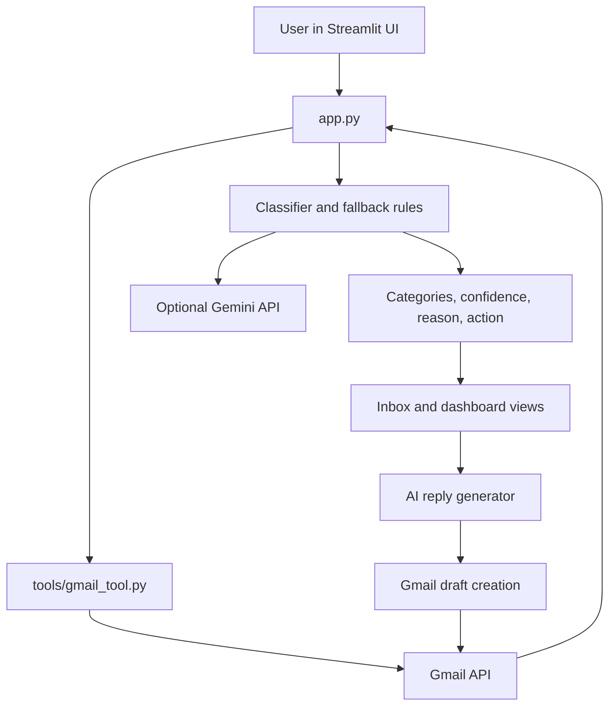

# MailMind AI Architecture

## Overview

MailMind AI is a Streamlit application with a Gmail integration and an optional Gemini intelligence layer. The application is intentionally fallback-friendly: Gmail is required for real inbox access, but classification and reply generation can still provide useful local responses when Gemini is unavailable.

## High-Level Flow



## Runtime Components

### `app.py`

The main application owns:

- Streamlit page configuration and session state
- Dashboard, Inbox, category pages, and sidebar navigation
- Theme and animation CSS
- Gmail connect and sync actions
- Classification orchestration
- Email detail, reply, and draft actions
- HTML email preview behavior

Session state stores the current Gmail service, loaded emails, classified emails, current page, sync status, theme selection, generated replies, and appearance state.

### `tools/gmail_tool.py`

This module is the Gmail boundary. It provides:

- OAuth credential construction from environment variables
- Gmail service creation
- Unread message listing
- Header, snippet, and body extraction
- Plain-text and HTML body extraction
- Inline `cid:` image conversion to data URLs
- Gmail draft creation
- Gmail label modification

The UI does not call Gmail API methods directly. It uses this module so Gmail-specific behavior remains isolated.

### `agents/`

These modules expose smaller reusable agent helpers:

- `reader.py` delegates email reading to the Gmail tool
- `classifier.py` contains a standalone Gemini classifier with a keyword fallback
- `drafter.py` contains a standalone Gemini reply drafter with a fallback reply

The main `app.py` currently contains its own richer classification and reply orchestration for the Streamlit experience. The standalone agent modules remain useful for tests and future graph integration.

### `graph/workflow.py`

Reserved for a LangGraph-style workflow. It is currently empty, so the production path is controlled by `app.py` rather than a graph runtime.

### `prompts/`

Prompt constants/modules from the earlier agent implementation. New prompt logic in the main UI is currently assembled near the relevant generator functions in `app.py`.

## Email Data Flow

A loaded email generally has this shape:

```python
{
    "id": "gmail-message-id",
    "sender": "person@example.com",
    "subject": "Message subject",
    "snippet": "Gmail preview text",
    "body": "Plain-text body",
    "html_body": "Optional original HTML body",
}
```

After classification, the app adds:

```python
{
    "category": "Urgent",
    "confidence": 85,
    "reason": "Why the category was chosen",
    "action": "Recommended next action",
}
```

## Classification Behavior

1. The app chooses the full body when available, otherwise the Gmail snippet.
2. If Gemini is configured, the app asks Gemini for one allowed category and structured metadata.
3. Invalid or unavailable Gemini responses fall back to keyword classification.
4. Fallback explanations and actions are category-specific, so every email does not show the same generic message.

## Rendering Behavior

- Plain-text email bodies use Streamlit text rendering.
- HTML email bodies use an isolated Streamlit HTML component to preserve layout and images.
- Inline Gmail images referenced with `cid:` are embedded as data URLs when attachments are available.
- Image-only emails are not passed through text-only summary logic.

## State and Reset Behavior

`Clear Workspace` clears loaded emails, classifications, filters, generated replies, generated mail content, page selection, appearance expansion, and sync status. Gmail authentication and the selected appearance theme are intentionally preserved.

## Extension Points

Good future boundaries for new features are:

- Add background or scheduled sync around `get_unread_emails`.
- Add bulk actions in the Inbox page without changing Gmail parsing.
- Move prompt strings from `app.py` into `prompts/`.
- Implement `graph/workflow.py` if a multi-agent workflow becomes necessary.
- Add typed email models and service interfaces before introducing more providers.
